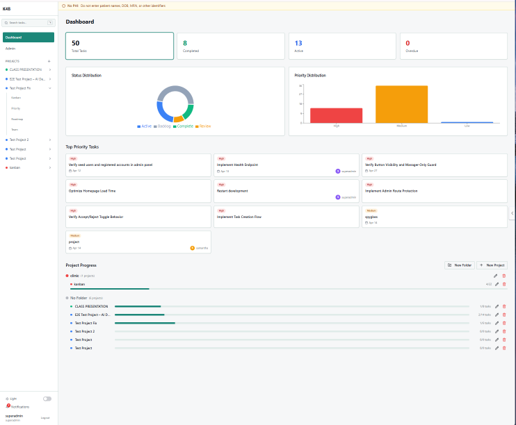
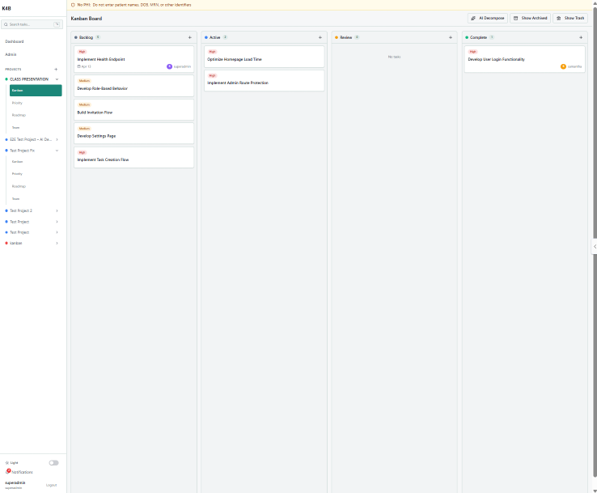

# Kanban for Business

## Project Overview

**Project Name:** Kanban for Business

**Program:** UCF Split Stack Software Engineering Program

**Track:** Back End

**Team Members:**
- Louverture-t
- SoloDev-Joe 
- Claude Code, VS code, AI 

**Elevator Pitch (1 minute):**
Kanban for Business is a Kanban-style project management app built for AIDP. It features five task visualization modes (Dashboard, Kanban, Priority, Roadmap, Team), three-tier role-based access control, AI-powered task decomposition and subtask generation: all deployed on Render with MongoDB Atlas.

## Problem Statement

- **Target Users:** owner (Superadmin), associates (Manager), team members (User)
- **Pain Points:** Fragmented tracking across clinical/business/HR/compliance/IT projects, no lightweight HIPAA-safe tool, manual planning overhead, no role separation
- **Proposed Solution:** Five view modes, AI task decomposition via OpenRouter, three-tier RBAC

## Core Features

- JWT authentication and three-tier RBAC (Superadmin/Manager/User)
- CRUD via GraphQL queries and mutations
- Keyword search with MongoDB text index (Ctrl+K)
- Responsive UI with dark/light mode, drag-and-drop Kanban
- Error handling, toast notifications, in-app notification bell

## Tech Stack

- **Frontend:** React 18, TypeScript, Vite, Tailwind CSS, Shadcn UI, Apollo Client, React Router v6
- **Backend:** Node.js 20 + Express 4 + Apollo Server v4 (GraphQL)
- **Database:** MongoDB + Mongoose v8
- **Auth:** JWT (jsonwebtoken + bcryptjs)
- **Deployment:** Render
- **CI/CD:** GitHub Actions
- **Styling/UI:** Tailwind CSS + Shadcn UI / Radix UI

## Architecture Summary

- Client communicates with GraphQL API via Apollo Client queries and mutations.
- Server handles validation, business logic, auth (JWT), and data access via Mongoose.
- MongoDB stores application data with Mongoose schemas.
- Protected resolvers require valid JWT tokens decoded in Apollo Server context.
- Secrets managed through environment variables on Render.

## Repository Structure

```text
.
├── client/              - React SPA (Vite, Apollo Client, Tailwind, Shadcn UI)
├── server/              - Express + Apollo Server, Mongoose models, GraphQL resolvers
├── shared/              - Shared TypeScript types
├── .github/workflows/   - CI (lint/typecheck) and deploy (Render hook)
├── render.yaml          - Render deployment config
└── README.md
```

## Local Setup

### 1. Clone the repository

```bash
git clone <repo-url>
cd kanban-for-business
```

### 2. Install dependencies

```bash
npm install
```

### 3. Configure environment variables

Create a `.env` file in `server/`:

```env
MONGODB_URI=<your-mongodb-atlas-connection-string>
JWT_SECRET=<your-secret>
OPENROUTER_API_KEY=<your-openrouter-key>
PORT=3001
```

Never commit secrets to source control.

### 4. Run the app

```bash
npm run dev
```

## Testing and Quality

- Linting: `npm run lint`
- Type check: `npm run check`
- Build validation: `npm run build`
- GitHub Actions workflow: `ci.yml` (runs on PRs to main)

## Deployment

- **Live App:** [https://kanban-for-business.onrender.com](https://kanban-for-business.onrender.com)
- **API Endpoint:** /graphql (same origin)
- **GitHub Repository:** [https://github.com/louverture-t/kanban-for-business](https://github.com/louverture-t/kanban-for-business)

## Screenshots

### Dashboard


### Kanban Board


## Showcase Presentation Checklist

Use this to prepare your team presentation.

- 1-minute elevator pitch
- User story and project motivation
- Team process, roles, and collaboration workflow
- Technical walkthrough of architecture and features
- Live demo of primary user flow
- Challenges, lessons learned, and wins
- Future roadmap
- Links to deployed app and repository

## Grading Alignment

This README supports the major evaluation categories:

- Technical implementation quality
- Concept clarity and project originality
- Deployment readiness
- Repository quality and documentation
- Application UX/UI quality
- Team presentation and collaboration

## Future Improvements

- Email and push notification delivery
- Semantic search with MongoDB Atlas Vector Search
- Weekly AI-generated progress reports
- File attachments on individual tasks
- Due-date reminder scheduling

## License

MIT
